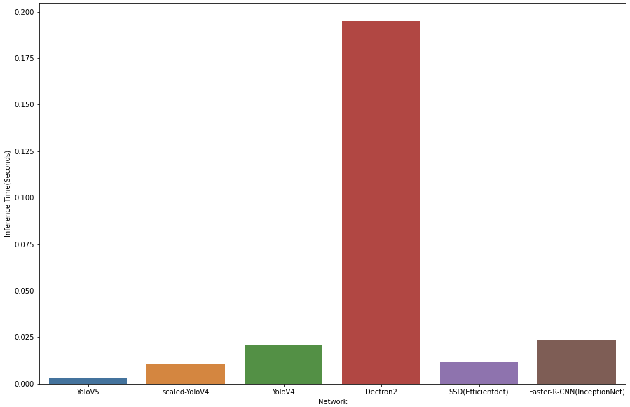
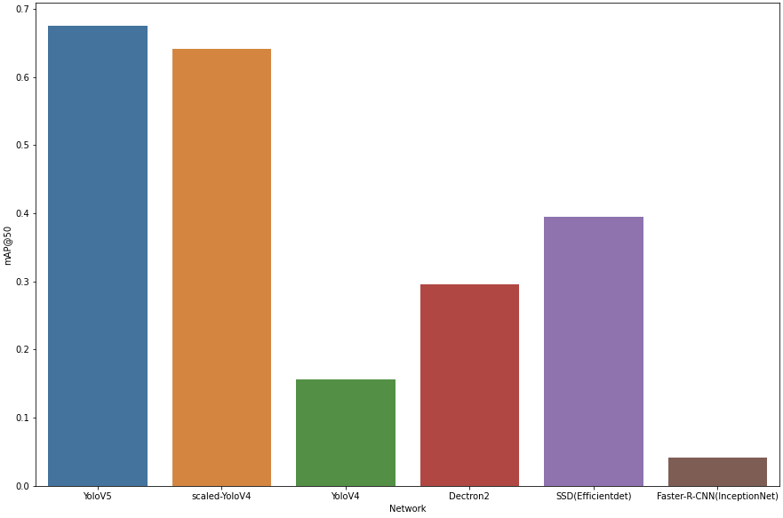

## A Study on the Possibility of Performance Improvement by Utilizing [YOLOV5](https://github.com/ultralytics/yolov5) as a method of Object Detection in Autonomous Driving

### 1. Continuous emergence of state-of-the-art technologies
Recently, with a lot of interest and investment in autonomous driving being made in Hyundai Motor, the latest technology, [YOLOv5(YOU ONLY LOOK ONCE VERSION 5)](https://github.com/ultralytics/yolov5), which can be used for autonomous object detection, has been announced.

### 2. Project Background
Always expecting high performance, state-of-the-art technologies have drawn much attention to their differences in performance from previous object detection networks such as [Mask R-CNN](https://github.com/facebookresearch/detectron2), [YOLOv4](https://github.com/AlexeyAB/darknet), [SSD](https://github.com/tensorflow/models/tree/master/research/object_detection), and [Faster R-CNN](https://github.com/tensorflow/models/tree/master/research/object_detection).

### 3. Project Topics
In this project, we leverage the state-of-the-art YOLOv5 in autonomous object detection to check training time, mAP (mean Average Precision), and FPS (inference time) results, and present solutions to the possibility of performance improvement by utilizing YOLOV5 as a method of object detection in autonomous driving.


## Neural networks for object detection (Custom Dataset Training)
- [Self-Driving-Dataset](https://public.roboflow.com/object-detection/self-driving-car)
- [YoloV5-Custom-Dataset-Training](YoloV5-Custom-Dataset-Training/YoloV5-Custom-Dataset-Training.ipynb)
- [ScaledyoloV4-Custom-Dataset-Training](ScaledyoloV4-Custom-Dataset-Training/ScaledyoloV4-Custom-Dataset-Training.ipynb)
- [YOLOv4-Darknet-Custom-Dataset-Training](YOLOv4-Darknet-Custom-Dataset-Training/YOLOv4-Darknet-Custom-Dataset-Training.ipynb)
- [SSD-Custom-Dataset-Training](SSD-Custom-Dataset-Training/SSD-Custom-Dataset-Training.ipynb)
- [Dectron2-Custom-Dataset-Training](Dectron2-Custom-Dataset-Training/Dectron2-Custom-Dataset-Training.ipynb)
- [Faster-R-CNN-Custom-Dataset-Training](Faster-R-CNN-Custom-Dataset-Training/Faster-R-CNN-Custom-Dataset-Training.ipynb)


## Enviorments
Google Colab and Kaggle notebooks with free GPU : [](https://colab.research.google.com/#create=true)

## Training Results (512 x 512)
### 1. Inference Time


### 2. mAP@50 


## Streamlit App that performs object detection


Running the application can be done following the instructions above:

### Dependencies
1. To create a Python Virtual Environment (virtualenv) to run the code, type:

    ```conda create -n streamlit_env python=3.7```

2. Activate the new environment:

    ```conda activate streamlit_env``` 

3. Install all the dependencies from *requirements.txt*:

    ```pip install -r requirements.txt```

### Use

Within the virtual environment:

```streamlit run streamlit_app.py```

## License

This project is licensed under the MIT License 
